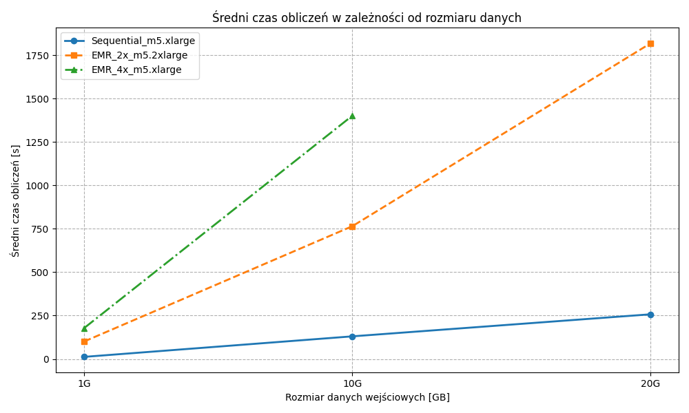

<script type="text/javascript" src="http://cdn.mathjax.org/mathjax/latest/MathJax.js?config=TeX-AMS-MML_HTMLorMML"></script>
<script type="text/x-mathjax-config">
    MathJax.Hub.Config({ tex2jax: {inlineMath: [['$', '$']]}, messageStyle: "none" });
</script>

# MapReduce

**Imię i nazwisko:** Robert Mesek  
**Data:** 18 maja 2026

---

## Zadanie

1. Wykonanie jak najbardziej wydajnej sekwencyjnej implementacji algorytmu Word Count i pomiar czasu jej działania dla danych 1G, 10G i 20G (baseline).
2. Wykonanie tych samych obliczeń z użyciem Hadoop na klastrze EMR w dwóch konfiguracjach o równej liczbie rdzeni roboczych (2 mocniejsze vs 4 słabsze węzły).
3. Wyciągnięcie wniosków oraz próba określenia metryki COST.

---

## Rozwiązanie

### 1. Implementacja sekwencyjna

Jako punkt odniesienia (baseline) wykorzystano zoptymalizowaną implementację algorytmu Word Count w języku Rust, uruchomioną na jednym rdzeniu instancji `m5.xlarge`.

**Uzasadnienie optymalności kodu:**

- Plik jest mapowany bezpośrednio do pamięci wirtualnej systemu operacyjnego wykorzystując bibliotekę `memmap2`. Pozwala to na unikanie narzutu standardowych buforów wejścia/wyjścia i zapewnia odczyt typu zero-copy.
- Konstrukcja mapy (`AHashMap<&[u8], u64>`) przechowuje bezpośrednie referencje do zmapowanej pamięci zamiast alokować nowe obiekty typu `String` dla każdego słowa.
- Zastosowano `AHashMap` o wysokiej wydajności. Dekodowanie znaków do formatu `WINDOWS_1252` następuje tylko raz w fazie zapisu gotowych wyników na standardowe wyjście przy użyciu szybkiego `BufWriter`.

```rust
use ahash::AHashMap;
use encoding_rs::WINDOWS_1252;
use memmap2::MmapOptions;
use std::env;
use std::fs::File;
use std::io::{self, BufWriter, Write};

fn main() -> io::Result<()> {
    let args: Vec<String> = env::args().collect();
    if args.len() < 2 {
        eprintln!("Usage: {} <file>", args[0]);
        std::process::exit(1);
    }

    let file = File::open(&args[1])?;
    let mmap = unsafe { MmapOptions::new().map(&file)? };

    let mut word_counts: AHashMap<&[u8], u64> = AHashMap::default();

    // Splitting by any ASCII whitespace
    for word in mmap.split(|b| b.is_ascii_whitespace()) {
        if !word.is_empty() {
            *word_counts.entry(word).or_insert(0) += 1;
        }
    }

    // Fast buffered output
    let stdout = io::stdout();
    let mut handle = BufWriter::new(stdout.lock());

    for (word_bytes, count) in word_counts {
        // Decode the bytes using the Windows-1252 encoding
        let (word_str, _encoding_used, _had_errors) = WINDOWS_1252.decode(word_bytes);

        writeln!(handle, "{}\t{}", word_str, count)?;
    }

    Ok(())
}
```

### 2. Wyniki pomiarów

Poniżej zestawiono czasy obliczeń na klastrach AWS EMR. Każdy test powtórzono dwukrotnie. Przy obliczaniu dwóch ostatnich testów przekroczono łączny limit czasu przyznany na ukończenie zadań w AWS Academy.



## 3. Wnioski

- Zoptymalizowany program w Rust przetwarzający dane na jednym rdzeniu okazał się wielokrotnie szybszy od klastrów rozproszonych dla wszystkich badanych wolumenów danych. Brak komunikacji sieciowej, narzutu platformy Hadoop oraz brak ciągłych alokacji pamięci pozwala na pełne wykorzystanie przepustowości lokalnego sprzętu.
- Konfiguracja oparta na 2 mocniejszych węzłach (`EMR_2x_m5.2xlarge`) uzyskała znacznie lepsze czasy niż konfiguracja z 4 słabszymi węzłami (`EMR_4x_m5.xlarge`), mimo identycznej łącznej liczby 16 rdzeni. Może to wynikać z redukcji transferów sieciowych w fazie "Shuffle and Sort". Z tego powodu większa część operacji mogła zostać wykonana lokalnie w ramach pamięci RAM pojedynczego, silniejszego serwera.
- Przetwarzanie 20 GB danych na 4 słabszych instancjach zakończyło się niepowodzeniem (TIMEOUT) z powodu przekroczenia łącznego limitu czasu na wykonanie zadań w środowisku AWS Academy.
- Dla testowanych zbiorów danych (1-20 GB) metryka COST dąży do nieskończoności. Rozproszony klaster Hadoop w żadnym wypadku nie zdołał poprawić czasu wykonania kodu sekwencyjnego. Narzuty na koordynację są zbyt duże dla danych tej wielkości.
